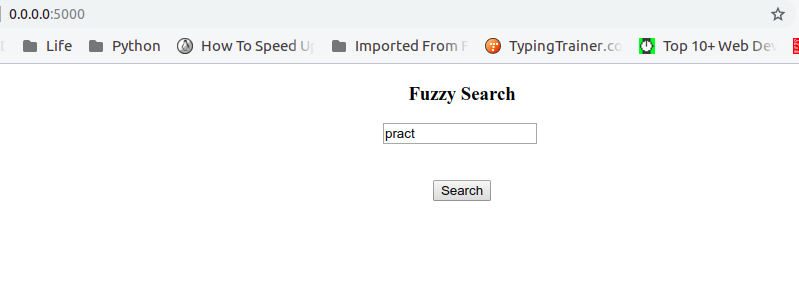
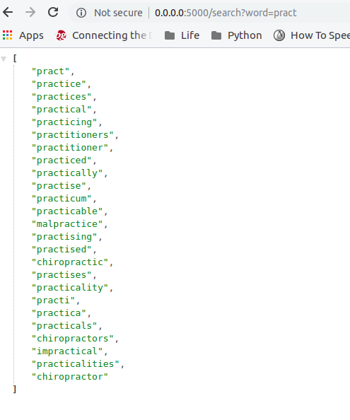

# Project : Fuzzy Search

## What it is and does
This webpage takes a word as input from user and results the json array with 25 words related to the word entered.

### Table of Contents
 
* [Required Libraries and Dependencies](#required-libraries-and-dependencies)
* [Project contents](#project-contents)
* [Templates](#templates)
* [How to Run the Project](#how-to-run-the-project)
* [Website Images](#crud-for-projects)

## Required Libraries and Dependencies
* Python 2.7.x
* [Flask](http://flask.pocoo.org/) 0.10.1 or higher (a web development microframework)


You can run the project in a Vagrant managed virtual machine (VM) which includes all the
required dependencies (see below for how to run the VM). For this you will need
[Vagrant](https://www.vagrantup.com/downloads) and
[VirtualBox](https://www.virtualbox.org/wiki/Downloads) software installed on your
system.

## Project contents
This project consists for the following files in the `FuzzySearch` directory:
* `app.py` -  The main Python script that serves the website.
 *`corpus.db`. Sqlite Database from which we query the result.
* `README.md` - This read me file.

* `/templates` -Contains the template index.html .
        
### Templates
The `/templates` directory contains the following file, written in HTML

* `index.html` - This webpage has a text box where the user can give the word to search as input.

## How to Run the Project
Download the Project file to you computer and unzip the file. Or clone this
repository to your desktop.

Open the text-based interface for your operating system (e.g. the terminal
window in Linux, the command prompt in Windows).

Navigate to the project directory and then enter the `vagrant` directory.

### Bringing the VM up
Bring up the VM with the following command:

```bash
vagrant up
```

The first time you run this command it will take awhile, as the VM image needs to
be downloaded.

You can then log into the VM with the following command:

```bash
vagrant ssh
```

More detailed instructions for installing the Vagrant VM can be found
[here](https://www.udacity.com/wiki/ud197/install-vagrant).

### Make sure you're in the right place
Once inside the VM, navigate to the t directory properties_dekho with this command:

```bash
cd /vagrant/FuzzySearch
```

### Run app.py
```bash
python app.py
```

It then starts a web server that serves the application. To view the application,
go to the following address using a browser on the host system:

```
http://localhost:5000/
```

You should see the  html page with text box where you can enter the word to search.


#### --------------------------------------
#### Images
#### --------------------------------------

`http://0.0.0.0:5000/` - Shows index.html


'http://0.0.0.0:5000/search?word=pract' -Shows result for user search


### Shutting the VM down
When you are finished with the VM, press `Ctrl-D` to logout of it and shut it down
with this command:

```bash
vagrant halt
```

